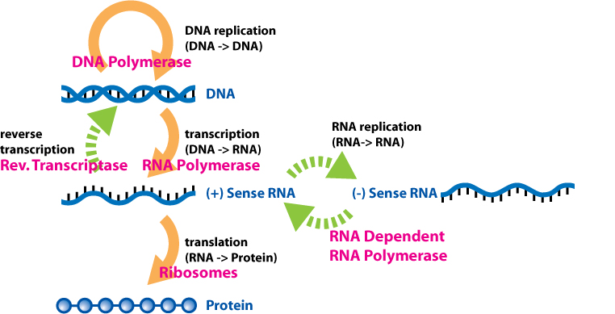

```{r,setup, include=FALSE}
knitr::opts_chunk$set(cache=TRUE)
```

# Introduction (Nima)

## Overview

* ...

* ...

* ...

## Overview

* ...

* ...

* ...

# Non-Negative Matrix Factorization (Nima)

## Why NMF?

* ...

* ...

* ...

## What is NMF?

* ...

* ...

* ...

## Alternative factorizations?

* ...

* ...

* ...

## NMF versus PCA

* ...

* ...

* ...

## Some fun with NMF

* ...

* ...

* ...

# A bit of biology (Amanda)

## What's cancer?

* ...

* ...

* ...

## Molecular biology of cancer

* ...

* ...

* ...

## DNA



# @alexandrov2013deciphering (Amanda & Courtney)

## Motivation (Courtney)

* ...

* ...

* ...

## Use of NMF (Courtney)

* ...

* ...

* ...

## Simulations (Courtney)

* ...

* ...

* ...

## Findings (Amanda)

* ...

* ...

* ...

# We've talked enough (Amanda)

## Discussion

* ...

* ...

* ...

## References

