```{r,setup, include=FALSE}
knitr::opts_chunk$set(cache=TRUE)
```

# Introduction

## Overview and Motivations

* Cancer biology is an extremely active area of research on all fronts, from
  molecular biology and bioinformatics to translational medicine.

* Statistical learning methods have met with great success when applied to
  complex and richly structured data, including images and text.

* Unsupervised clustering (e.g., matrix factorization) may help to learn about
  or discover fundamental common properties of various cancers.

* We review the key mathematical details of and explore the uses of matrix
  factorization (in particular, NMF) in cancer biology.

## Overview of Matrix Factorization

* Matrix factorization as unsupervised learning

* What can we learn about objects by matrix factorization?

* A general formulation of matrix factorization

* Various forms of matrix factorization: NMF, PCA, VQ

* Applications of matrix factorization: images

* Biological applications of matrix factorization

# Non-Negative Matrix Factorization

## What is Matrix Factorization?

* Suppose we have a _data matrix_ $V$ of dimension $n \times m$, each column of
  which is an $n$-vector of observations.

* A factorization of $V$ produces two matrices $\{W, H\}$ that approximately
  capture the information present in $V$.

* From linear algebra, we have $V_{ij} \approx (W H)_{ij} = \sum_{a = 1}^r
  W_{ia} H_{aj}$.

* The dimensionality of the induced matrix factors is reduced wrt $V$ -- that
  is, let $W$ be $n \times r$ and $H$ be $r \times m$.

* This can be viewed as a form of data compression when the rank $r$ is small in
  comparison to $n$ and $m$.
  * In particular, $r$ is often chosen such that $(n + m)r \leq nm$.
  * Since we control $r$, we control the degree of data compression.

## What is Matrix Factorization?

* With the factorization $V_{ij} \approx \sum_{a = 1}^r W_{ia} H_{aj}$, the
  matrix factors $W$ and $H$ each pick up different important aspects of $V$.

* When $V$ is a $n \times m$ matrix of images of faces, where each row
  corresponds to a pixel and each column an image:
  * the $r$ columns of $W$ may be thought of as basis images,
  * and each of the $j$ columns of $H$ is termed an encoding (coefficients to be
    applied to basis images).

* Various forms of matrix factorization place different types of constraints on
  the manner in which $W$ and $H$ are generated.

## Vector Quantization (VQ)

* __Constraint:__ each column of $H$ has a single entry equal to unity, with all
  other entries being set to zero.

* Since this is a constraint on the _encoding_ columns, this results in each
  column of $W$ being a distortion of the target image.

* Equivalently, each column of $V$ is approximated by a single basis (column of
  $W$).

* In terms of image processing/learning, VQ constraint is responsible for the
  decomposition learning _prototypical_ faces.

## VQ: Prototypical Faces

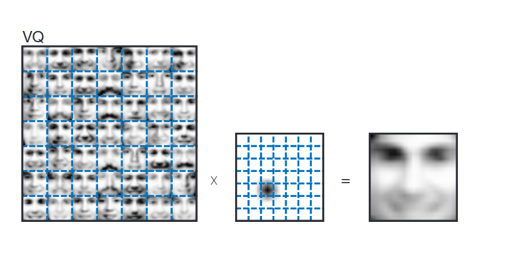{height=100%}

## Principal Components Analysis (PCA)

* __Constraint:__ columns of $W$ are set to be orthonormal; rows of $H$ are set
  to be orthogonal to one another.

* Relaxation of VQ constraint: each face in our data set may be represented by a
  linear combination of basis images in $W$.

* This results in a distributed encoding of each of the face images in $V$;
  basis images have been termed _eigenfaces_.

* Statistical interpretation: each eigenface represents the direction of largest
  variance within the sample data.

* Intuitive interpretation: ??? (Complex cancellations make eigenfaces very
  difficult to interpret.)

## PCA: _Eigenfaces_

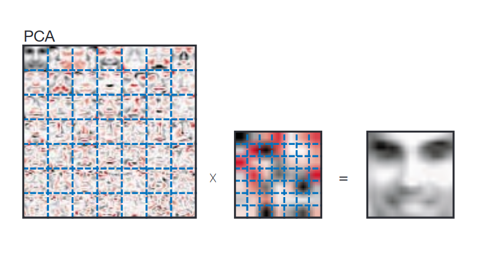{height=100%}

## PCA in Biology: Population Genetics in Europe

* Obligatory example: @novembre2008genes, "Genes mirror geography within
  Europe", _Nature_.

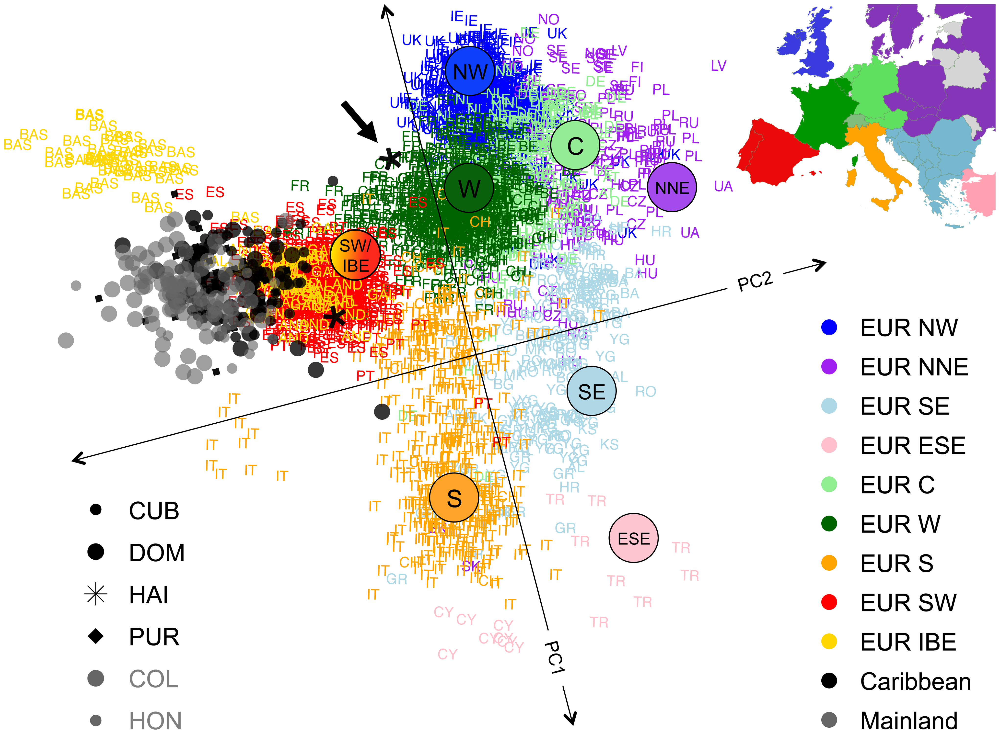{height=70%}

## What is NMF?

* __Constraint:__ decomposition into matrix factors $W$ and $H$, wherein any
  nonzero entries in $W$ and $H$ must be _positive_.

* Since there are no cancellations (unlike in PCA), multiple basis images may be
  used to reconstruct a face by additive linear combination.

* Since basis images and encodings are all positive, each basis image may be
  thought of as picking up a _part of a face_.

## What does non-negativity buy us?

* In practice, NMF produces sparse basis and encoding matrices.

* The basis images are _non-global_ -- that is, groups of basis images pick up
  variation in a part of a face (e.g., eyes, mouth).

* The encoding are also sparse, since not all basis images are used in
  reconstituting any given face image.

* Thus, encodings are _sparsely distributed_, unlike the fully distributed
  encodings of PCA and the unary encodings of VQ.

## NMF: Parts of Faces

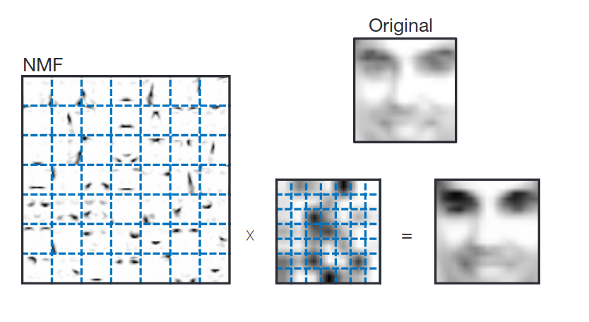{height=90%}

## Overview of NMF

* Generally, NMF may be viewed as a generative model (neural network) for how
  the directly observable variables $V$ arise from hidden variables $H$.

* Each hidden variable (in $H$) may be thought of as co-activating a subset of
  the visible variables to reconstruct an example.

* In particular, a large and varied group of hidden variables may be combined
  additively to generate a whole example.

## Implementing NMF

* @lee1999learning combine a set of update rules with an objective function
  $$F = \sum_{i = 1}^n \sum_{\mu = 1}^m V_{i \mu} \log(WH)_{i \mu} - (WH)_{i
  \mu},$$
  which converges to a local maximum with iterative updates under the given
  rules.

* Update rules:
  1. $W_{ia} \leftarrow W_{ia} \sum_{\mu} \frac{V_{i \mu}}{(WH)_{i \mu}} H_{a
     \mu}$
  2. $W_{ia} \leftarrow \frac{W_{ia}}{\sum_j W_{ja}}$
  3. $H_{a \mu} \leftarrow H_{a \mu} \sum_i W_{ia} \frac{V_{i \mu}}{(WH)_{i
     \mu}}$

* Exact form of objective function is not too important -- could also simply use
  a squared error objective function.

## NMF as a neural network

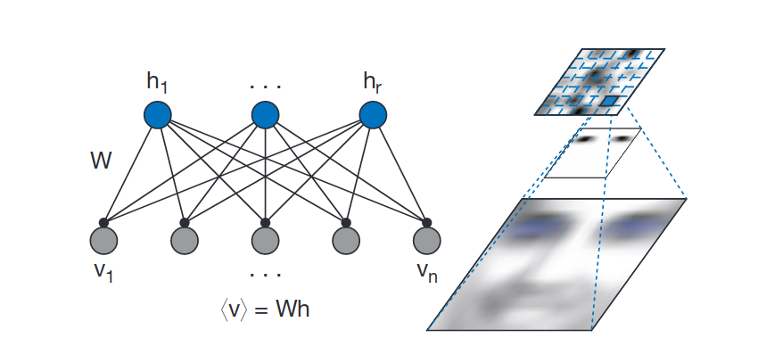{height=90%}

## NMF as a neural network

* Visible variables $V$ generated by excitatory connections between hidden
  variables $H$.

* To learn values of the hidden variables $H$, an additional set of inhibitory
  feedback connections is required.

* The non-negativity constraints that define NMF capture intuitive biological
  notions of how neurons work, suggesting that NMFs may present a simplified
  model of how the brain learns parts of objects in perception.

## NMF in cancer biology

* So, we've now established that NMF finds _parts_ of the input matrix through
  the non-negativity constraint it imposes on the matrix factors.

* This has important applications for exploring cancer biology; namely, applying
  NMF could help us detect _parts of tumors_.

* Interpretation is challenging: does this mean we're detecting subclonal
  populations?

* There's a whole lot more to come.

# A bit of biology (Amanda)

## What is cancer?

* Complex tissues with multiple cell types and interactions

* Characterized by unchecked somatic cell proliferation

* Normal cells acquire hallmark traits that enable them to become tumorigenic ^[@hanahan2011hallmarks]

## Hallmarks of Cancer


## Cancer is a genetic disease

* Germline mutations: inherited from parents

    * Mutations in tumor suppressor genes or oncogenes can predispose someone to develop cancer

* Somatic mutations: acquired over time in somatic cells

    * Endogenous: DNA damage as a result of metabolic byproducts

    * Exogenous: DNA damage as a result of mutagenic exposure

* Epigenetic modifications: no change to DNA sequence

    * DNA methylation

    * Histone modification

    * MicroRNA gene silencing

## Somatic mutations

* Rearrangements

* Copy number changes

* Indels

* Base substitutions

    * 6 types of substitutions (C>G, C>T, C>A, G>T, G>A, T>A)

    * 4 types of 5' base nucleotide

    * 4 types of 3' base nucleotide

    * Transcriptional strand

## Clonal evolution in cancer

# Applying NMF to mutational processes

## @alexandrov2013deciphering characterize mutational processess as a blind source separation problem

Mutational catalogs "are the cumulative result of all the somatic mutational
mechanisms ...that have been operative during the cellular lineage starting from
the fertilized egg...to the cancer cell."

{height=45%}

## How is the work of @alexandrov2013deciphering related to inferring clonal evolution of tumors?

Goal: learn the "evolutionary history and population frequency of the subclonal lineages of tumor cells."

* From SNV frequency measurements, try to infer the phylogeny and genotype of the major subclonal lineages.

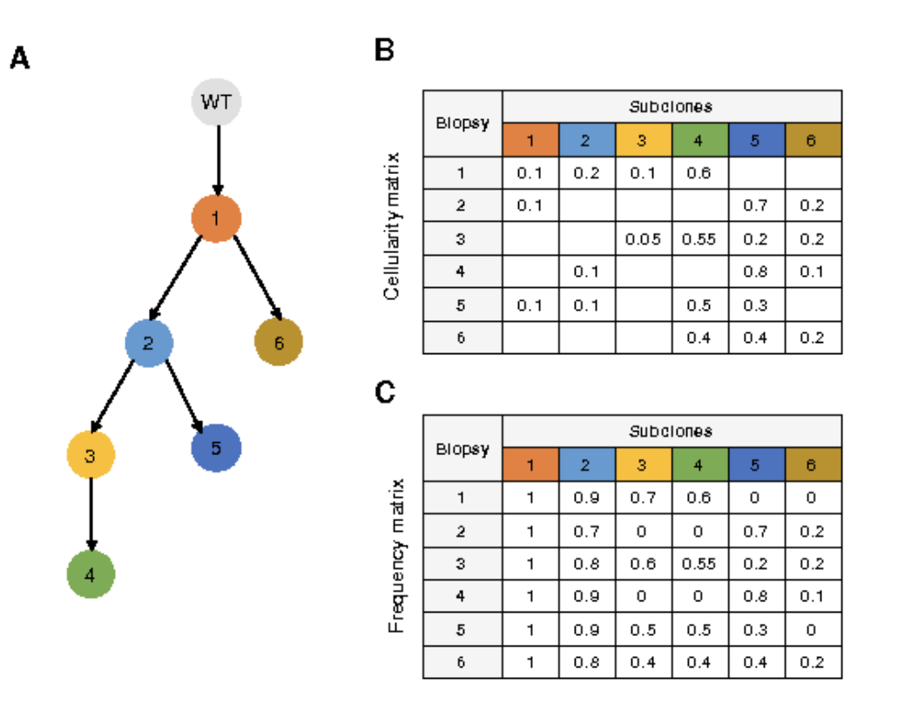{height=40%}

## How is the work of @alexandrov2013deciphering. related to inferring clonal evolution of tumors?

Different clonal mutations will have different signatures.

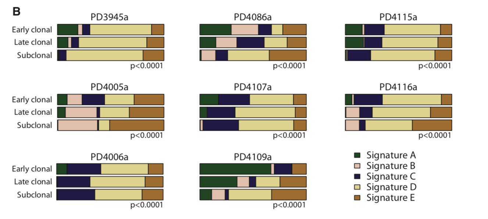{height=40%}


## Both works want to uncover driver mutations

Inferring clonal evolution of tumors

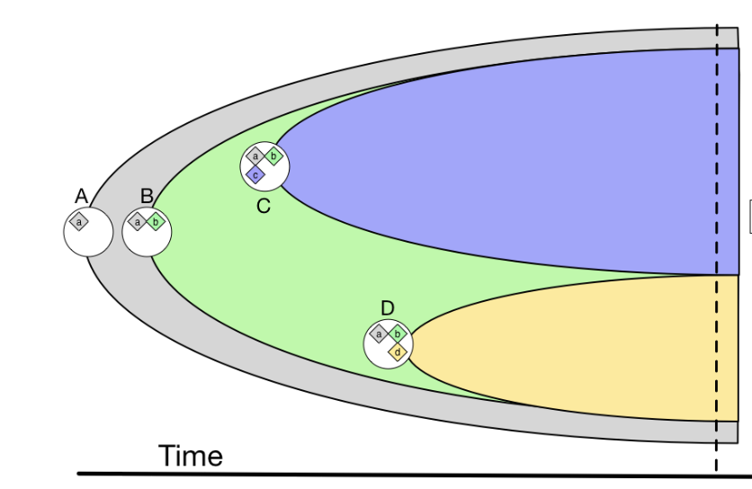{width=30%}

Deciphering Signatures of mutational processes

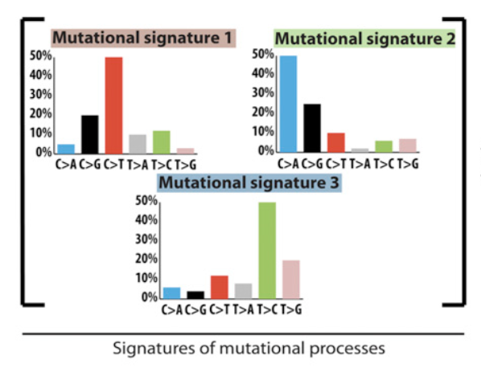{width=30%}


## @alexandrov2013deciphering focus more on uncovering the cumulative mutational processes that make up a cancer genome, rather than the evolution of the tumor.

{height=50%}


## NMF is a natural method for handling the BSS problem.

* Non-negative matrix entries.

* Want to learn the parts (mutational signatures of mutational processes) that
  add to the whole (mutational catalog).


{height=45%}


## What are the basis vectors and encodings in the context of mutational processes?


$$M \approx P\times E$$

$M$, $K$ mutation types by $G$ genomes

$P$, $K$ mutation types by $N$ mutation signatures

$E$, $N$ mutation signatures by $G$ genomes


## What are the basis vectors and encodings in the context of mutational processes?

{width=55%}{width=25%}

* $K=$ number of mutation types.

* $N=$ number of signatures.

* $G=$ number of genomes.


## The parts that make up the whole in mutational processes.


## Method for deciphering signatures of mutational processes

1. Input matrix $M$ of dimension $K$ (mutation types) by $G$ (genomes).

2. Remove rare mutations ($\leq 1\%$).

3. Monte Carlo bootstrap resampling.


## Method for deciphering signatures of mutational processes.

4. Apply the multiplicative update algorithm until convergence.
* Repeat steps 3 and 4 $I$ times, each time storing $P$ and $E$.
* Typical values $I=400-500$


{width=35%}

{width=30%}


## Method for deciphering signatures of mutational processes

5. Cluster the signatures (columns of $P$ matrix) from the $I$ iterations into $N$ clusters, one signature per cluster for each of the $I$ matrices.
  * This automatically clusters the exposures.
  * Use cosine similarity for clustering.

{width=40%}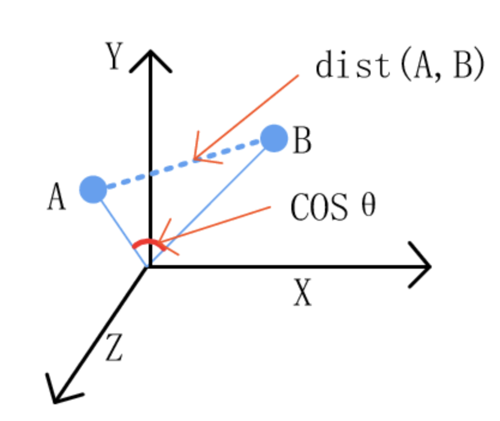{width=25%}
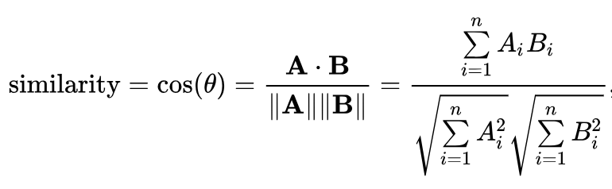{width=40%}


## Method for deciphering signatures of mutational processes

6. Create the iteration averaged centroid matrix, $\overline{\rm P}$, by averaging the signatures within each cluster.

7. Evaluate the reproducibility of the signatures by calculating the average silhouette width over the $N$ clusters.

{width=50%}


## Method for deciphering signatures of mutational processes

8. Evaluate the accuracy of the approximation of $M$ by calculating the Frobenius reconstruction errors.

{width=40%}

9. Repeat steps 1-8 for different values of $N=1,\dots,min(K,G)-1$.

## Method for deciphering signatures of mutational processes

10. Choose an $N$ corresponding to highly reproducible mutational signatures and low reconstruction error.

{height=40%}


## The method is affected by the number of genomes, uniqueness of signatures, and number of mutations


## The method recovers 10 signatures in a simulated cancer genome dataset


## Findings (Amanda)

* ...

* ...

* ...

# We've talked enough (Amanda)

## Discussion

* ...

* ...

* ...

## References

