```{r,setup, include=FALSE}
knitr::opts_chunk$set(cache=TRUE)
```

# Introduction (Nima)

## Overview

* ...

* ...

* ...

## Overview

* ...

* ...

* ...

# Non-Negative Matrix Factorization (Nima)

## Why NMF?

* ...

* ...

* ...

## What is NMF?

* ...

* ...

* ...

## Alternative factorizations?

* ...

* ...

* ...

## NMF versus PCA

* ...

* ...

* ...

## Some fun with NMF

* ...

* ...

* ...

# A bit of biology (Amanda)

## What is cancer?

* Complex tissues with multiple cell types and interactions

* Characterized by unchecked somatic cell proliferation

* Normal cells acquire hallmark traits that enable them to become tumorigenic ^[@hanahan2011hallmarks]

## Hallmarks of Cancer

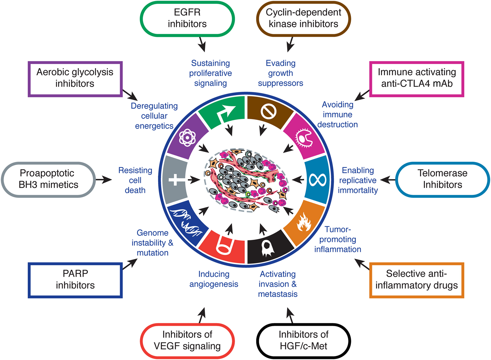

## Cancer is a genetic disease

* Germline mutations: inherited from parents

    * Mutations in tumor suppressor genes or oncogenes can predispose someone to develop cancer

* Somatic mutations: acquired over time in somatic cells

    * Endogenous: DNA damage as a result of metabolic byproducts
    
    * Exogenous: DNA damage as a result of mutagenic exposure
    
* Epigenetic modifications: no change to DNA sequence

    * DNA methylation
    
    * Histone modification
    
    * MicroRNA gene silencing

## Somatic mutations

* Rearrangements

* Copy number changes

* Indels

* Base substitutions

    * 6 types of substitutions (C>G, C>T, C>A, G>T, G>A, T>A)
    
    * 4 types of 5' base nucleotide
    
    * 4 types of 3' base nucleotide
    
    * Transcriptional strand

## Clonal evolution in cancer

# Applying NMF to a biological challenge

## Alexandrov et al. characterize mutational processess as a blind source separation problem

Mutational catalogs "are the cumulative result of all the somatic mutational mechanisms ...that have been operative during the cellular lineage starting from the fertilized egg...to the cancer cell."

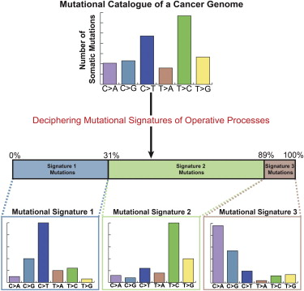{height=45%}

## NMF is a natural method for handling the BSS problem


{height=60%}

* Non-negative matrix entries.

* Want to learn the parts (mutational signatures of mutational processes) that add to the whole (mutational catalog).

## What are the basis vectors and encodings in the context of mutational processes?

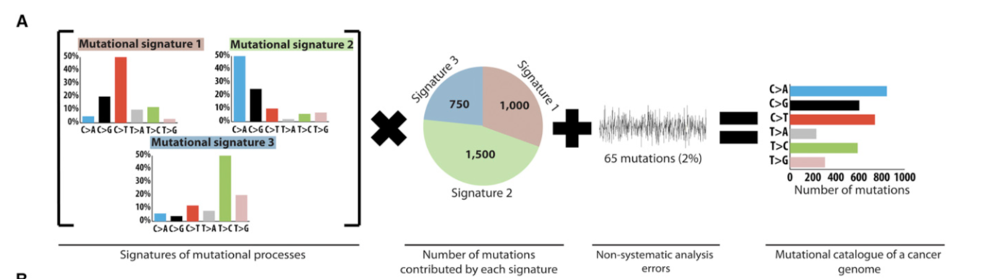
$$M \approx P\times E$$

$M$, $K$ mutation types by $G$ genomes

$P$, $K$ mutation types by $N$ mutation signatures

$E$, $N$ mutation signatures by $G$ genomes


## What are the basis vectors and encodings in the context of mutational processes?

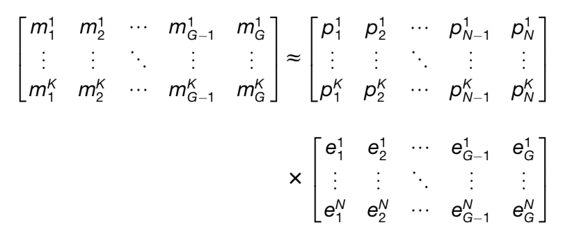{width=80%}

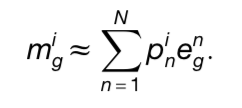{width=30%}


## The parts that make up the whole in mutational processes

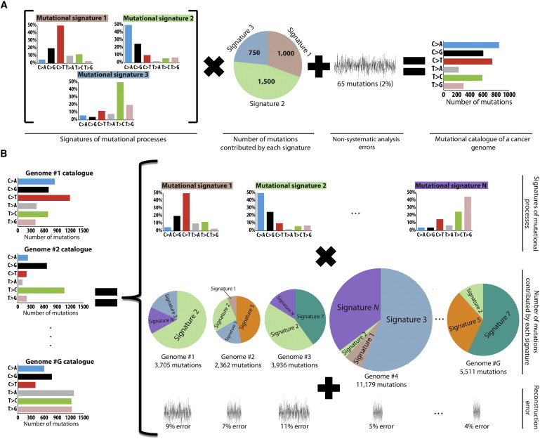

## Method for deciphering signatures of mutational processes

1. Input matrix $M$ of dimension $K$ (mutation types) by $G$ (genomes).

2. Remove rare mutations (< 1%).

3. Monte Carlo bootstrap resampling.


## Method for deciphering signatures of mutational processes

4. Apply the multiplicative update algorithm until convergence.
* Repeat steps 3 and 4 $I$ times, each time storing $P$ and $E$.
* Typical values $I=400-500$


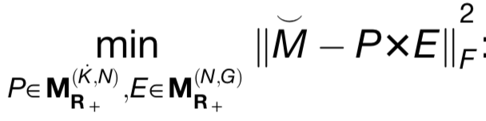{width=35%}

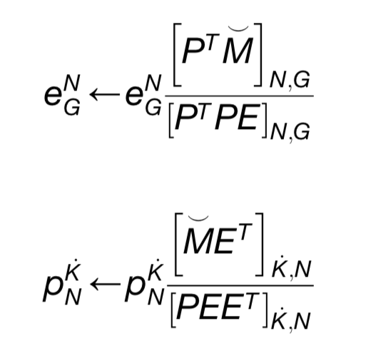{width=30%}


## Method for deciphering signatures of mutational processes

5. Cluster the signatures (columns of $P$ matrix) from the $I$ iterations into $N$ clusters, one signature per cluster for each of the $I$ matrices.
  * This automatically clusters the exposures.
  * Use cosine similarity for clustering.

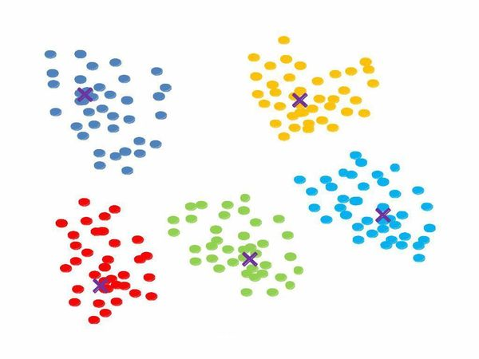{width=40%}


## Method for deciphering signatures of mutational processes

6. Create the iteration averaged centroid matrix, $\overline{\rm P}$, by averaging the signatures within each cluster.

7. Evaluate the reproducibility of the signatures by calculating the average silhouette width over the $N$ clusters.

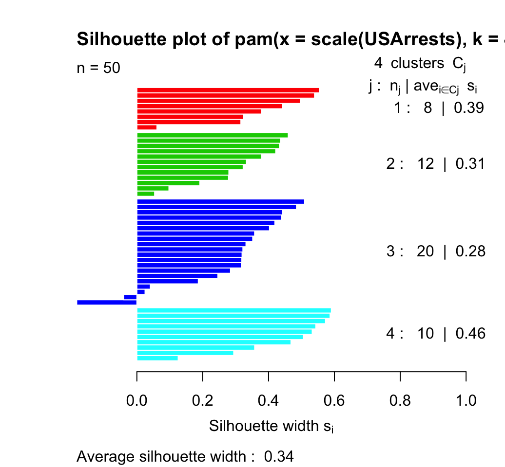{width=50%}


## Method for deciphering signatures of mutational processes

8. Evaluate the accuracy of the approximation of $M$ by calculating the Frobenius reconstruction errors.

{width=40%}

9. Repeat steps 1-8 for different values of $N=1,\dots,min(K,G)-1$.

## Method for deciphering signatures of mutational processes

10. Choose an $N$ corresponding to highly reproducible mutational signatures and low reconstruction error.

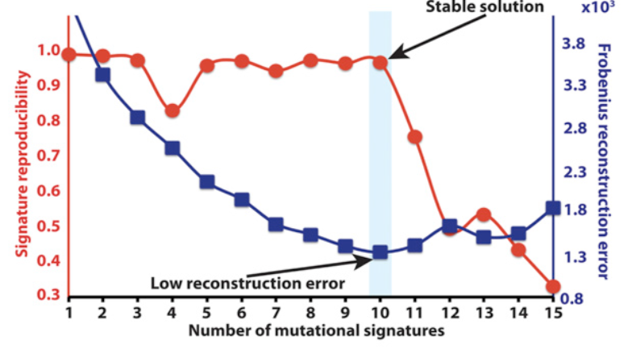{height=40%}


## The method is affected by the number of genomes, uniqueness of signatures, and number of mutations


## The method recovers 10 signatures in a simulated cancer genome dataset


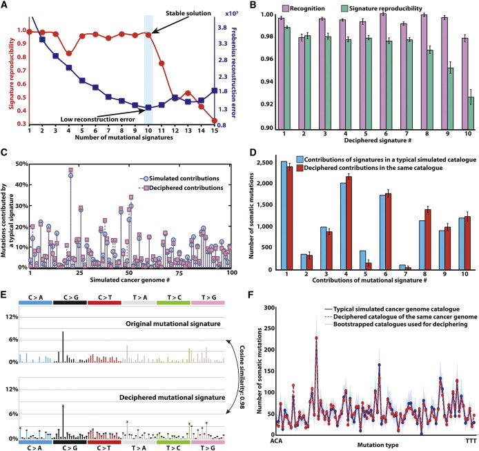

## Findings (Amanda)

* ...

* ...

* ...

# We've talked enough (Amanda)

## Discussion

* ...

* ...

* ...

## References

