```{r,setup, include=FALSE}
knitr::opts_chunk$set(cache=TRUE)
```

# Introduction

## Overview and Motivations

* Cancer biology is an extremely active area of research on all fronts, from
  molecular biology to clinical medicine.

* Statistical learning methods have met with great success when applied to
  complex and richly structured data (e.g., images).

* We review the key mathematical details of and explore the uses of matrix
  factorization (esp., NMF) in biology.

## Overview of Matrix Factorization/Decomposition

* Matrix factorization/decomposition as unsupervised learning

* What can we learn about objects by matrix factorization?

* A generalized formulation of matrix factorization

* Various forms of matrix factorization: NMF, PCA, VQ

* Applications of matrix factorization: image learning

* Biological applications of matrix factorization

# Matrix Factorization Primer

## What is Matrix Factorization/Decomposition?

* Suppose we have a _data matrix_ $V$ of dimension $n \times m$, each column of
  which is an $n$-vector of observations.

* A factorization of $V$ produces some number of matrices that may be used to
  exactly (or approximately) reconstruct $V$.

* A few common matrix decompositions include
  * QR decomposition: $V = Q R$, where $dim(Q) = m \times m$ and $dim(R) = m
    \times n$
  * Spectral decomposition: $V = W D W^{-1}$, where $W$ contains eigenvectors of
    $W$ and $D$ its eigenvalues.
  * Singular value decomposition: $V = U \Sigma W^*$, where $\Sigma$ contains
    the singular values of $V$.

## What is Matrix Factorization/Decomposition?

* For our purposes, we consider a factorization of $V$ producing two matrices
  $\{W, H\}$ that approximately capture the information present in $V$.

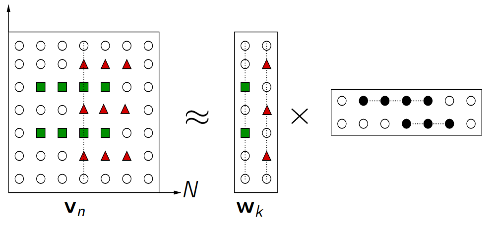{height=65%}
*Illustration by C. Fevotte*

## What is Matrix Factorization/Decomposition?

* From linear algebra, we have $V_{ij} \approx (W H)_{ij} = \sum_{a = 1}^r
  W_{ia} H_{aj}$.

* The dimensionality of the induced matrix factors is reduced wrt $V$ -- that
  is, let $W$ be $n \times r$ and $H$ be $r \times m$.

* This can be viewed as a form of data compression when the rank $r$ is small in
  comparison to $n$ and $m$.
  * In particular, $r$ is often chosen such that $(n + m)r \leq nm$.
  * Since we control $r$, we control the degree of data compression.

## Explaining Data by Matrix Factorization

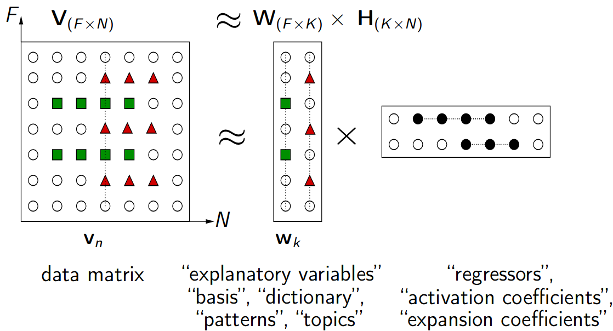{height=65%}
*Illustration by C. Fevotte*

## What is Matrix Factorization/Decomposition?

* With the factorization $V_{ij} \approx \sum_{a = 1}^r W_{ia} H_{aj}$, the
  matrix factors $W$ and $H$ each pick up different important aspects of $V$.

* When $V$ is a $n \times m$ matrix of images of faces, where each row
  corresponds to a pixel and each column an image:
  * the $r$ columns of $W$ may be thought of as basis images,
  * and each of the $j$ columns of $H$ is termed an encoding (coefficients to be
    applied to basis images).

## Linear Algebra Review

* Consider the problem $V u = \lambda u$, for an $n \times n$ square matrix $V$.
  * $u$ is an vector of dimension $n$, called an _eigenvector_ of $V$.
  * $\lambda$ is a scalar, called an _eigenvalue_ of $V$.

* The eigenvectors are simply the set of vectors that are stretched or shrunk by
  application of $V$.

{height=50%}

*from Wikipedia*

## What is Matrix Factorization/Decomposition?

* Various forms of matrix factorization place different types of constraints on
  the manner in which $W$ and $H$ are generated.

* We will compare and contrast three forms of matrix factorization, as per the
  work of @lee1999learning:
  * Vector quantization (VQ)
  * Principal components analysis (PCA)
  * Non-negative matrix factorization (NMF)

## Vector Quantization (VQ)

* __Constraint:__ each column of $H$ has a single entry equal to unity, with all
  other entries being set to zero.

* Since this is a constraint on the _encoding_ columns, this results in each
  column of $W$ being a distortion of the target image.

* Equivalently, each column of $V$ is approximated by a single basis (column of
  $W$).

* In terms of image processing, the VQ constraint results in decomposition-based
  learning of _prototypical_ faces.

## VQ: Prototypical Faces

{height=100%}
*VQ factorization enforces a unary encoding constraint.*

*Distorted Basis (of Prototypes) $\times$ Unary Encoding (coefficients)*

## Principal Components Analysis (PCA)

* Assumptions: real-valued and centered data $V$.

* PCs are scaled eigenvectors of the covariance matrix of $V$.

* Statistical interpretation: each eigenface represents the direction of largest
  variance within the sample data.

{height=50%}

*from Wikipedia*

## Principal Components Analysis (PCA)

* Assumptions: real-valued and centered data $V$.


## Principal Components Analysis (PCA)

* __Constraint:__ columns of $W$ are set to be orthonormal; rows of $H$ are set
  to be orthogonal to one another.

* Relaxation of VQ constraint: each face in our data set may be represented by a
  linear combination of basis images in $W$.

* This results in a distributed encoding of each of the face images in $V$;
  basis images have been termed _eigenfaces_.

* Intuitive interpretation: ??? (Complex cancellations make eigenfaces very
  difficult to interpret.)

## PCA: _Eigenfaces_

{height=100%}
*PCA factorization enforces a distributed encoding constraint.*

*Basis (Eigenfaces) $\times$ Distributed Encoding (coefficients)*

## PCA in Biology: Population Genetics in Europe

* Obligatory example: @novembre2008genes, "Genes mirror geography within
  Europe", _Nature_.

{height=70%}

# Non-Negative Matrix Factorization

## What is Non-Negative Matrix Factorization (NMF)?

* __Constraint:__ decomposition into matrix factors $W$ and $H$, wherein any
  nonzero entries in $W$ and $H$ must be _positive_.

* Since there are no cancellations (unlike in PCA), multiple basis images may be
  used to reconstruct a face by additive linear combination.

* Since basis images and encodings are all positive, each basis image may be
  thought of as picking up a _part of a face_.

* __Downside:__ NMF is ill-posed -- i.e., non-unique solutions exist.

## Enforcing Non-negativity

* In practice, NMF produces sparse basis and encoding matrices.

* The basis images are _non-global_ -- that is, groups of basis images pick up
  variation in a part of a face (e.g., eyes).

* The encoding are also sparse, since not all basis images are used in
  reconstituting any given face image.

* Thus, encodings are _sparsely distributed_, unlike the fully distributed
  encodings of PCA and the unary encodings of VQ.

## NMF: Parts of Faces

{height=90%}
*NMF enforces a sparse and positive encoding constraint.*

*Non-Global Basis (Grouped) $\times$ Sparse Encoding (coefficients)*

## NMF: Parts of Faces

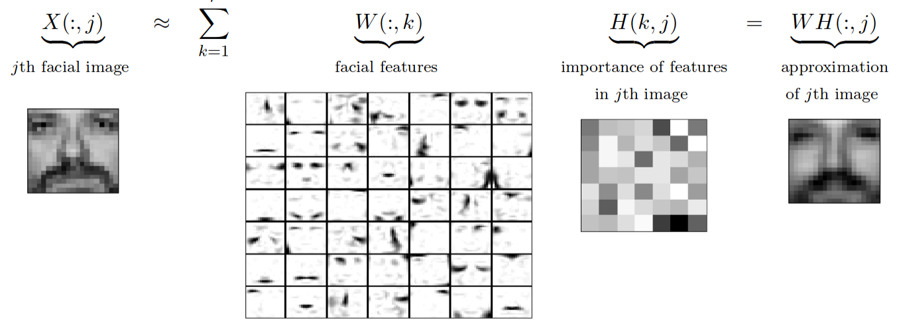{height=90%}
*from @gillis2014and*

## NMF as a Generative Model

* Generally, NMF may be viewed as a generative model for how directly observable
  variables $V$ arise from hidden variables $H$.

* Each hidden variable (in $H$) may be seen as co-activating a subset of the
  visible variables to reconstruct an example.

* In particular, a large and varied group of hidden variables may be combined
  additively to generate a whole example.

## NMF as a Generative Model

{height=90%}
*Simple 2-layer neural net with encodings ($h$) as hidden variables that
activate subsets of visible variables ($W$) to reconstruct $V$.*

## NMF as a Generative Model

* Visible variables $V$ generated by excitatory connections between hidden
  variables $H$.

* To learn values of the hidden variables $H$, an additional set of inhibitory
  feedback connections is required.

* The non-negativity constraints that define NMF capture intuitive biological
  notions of how neurons work, suggesting that NMFs may present a simplified
  model of how the brain learns parts of objects in perception.

## Implementing NMF

* @lee1999learning provide a likelihood-based approach, deriving an objective
  function $$F = \sum_{i = 1}^n \sum_{\mu = 1}^m V_{i \mu} \log(WH)_{i \mu} -
  (WH)_{i \mu} \.$$

* _Interpretation_: log-likelihood maximized when solving for $W$ and $H$ same
  as log-likelihood in a model where $V_{ij}$ has a Poisson distribution with
  mean $(WH)_{ij}$.

* Exact form of objective function is not too important -- could also simply use
  a squared error objective function.

## Implementing NMF

* @lee1999learning propose a set of update rules that, upon iteration, force
  convergence of the objective function to a local maximum while satisfying the
  NMF criteria.

* Update rules:
  * $W_{ia} \leftarrow W_{ia} \sum_{\mu} \frac{V_{i \mu}}{(WH)_{i \mu}} H_{a
    \mu}$ and $W_{ia} \leftarrow \frac{W_{ia}}{\sum_j W_{ja}}$
  * $H_{a \mu} \leftarrow H_{a \mu} \sum_i W_{ia} \frac{V_{i \mu}}{(WH)_{i
    \mu}}$

* These update rules
  * force monotonic convergence under objective function,
  * preserve non-negativity of the factors $W$ and $H$, and
  * constrain columns of $W$ to sum to unity.

## NMF in Biology

* So, we've now established that NMF finds _parts_ of the input matrix through
  the non-negativity constraint it imposes on the matrix factors.

* This has important applications for exploring cancer biology; namely, applying
  NMF could help us detect _parts of tumors_.

* Interpretation is challenging: does this mean we're detecting sub-clonal
  populations?

# A bit of biology

## What is cancer?

* Complex tissues with multiple cell types and interactions

* Characterized by unchecked somatic cell proliferation

* Normal cells acquire hallmark traits that enable them to become tumorigenic ^[@hanahan2011hallmarks]

## What is cancer?


## Cancer is a genetic disease

* Germline mutations: inherited from parents

    * Mutations in tumor suppressor genes or oncogenes can predispose someone to develop cancer

* Somatic mutations: acquired over time in somatic cells

    * Endogenous: DNA damage as a result of metabolic byproducts

    * Exogenous: DNA damage as a result of mutagenic exposure

* Epigenetic modifications: no change to DNA sequence

    * DNA methylation

    * Histone modification

    * MicroRNA gene silencing

## What causes these mutations?

__DNA-damaging exposures__

* Carcinogens in tobacco smoke

    * Polycyclic aromatic hydrocarbons (PAHs) form DNA adducts

    * Nitrosamines induce DNA alkylation

* UV radiation

    * Direct: dimerization of neighboring pyrimidines

    * Indirect: production of reactive oxygen species

* Chronic inflammation

    * Reactive oxygen and nitrogen species produced by innate immune system

    * Detection of DNA damage can activate immune response

## What causes these mutations?


\begin{columns}

\begin{column}{0.48\textwidth}
\textbf{Error-prone DNA repair}
\textit{Single-strand damage}
\begin{itemize}
  \item{Use complementary strand as template}
  \item{Base excision repair: remove single base}
  \item{Nucleotide excision repair: remove 12-24 bases}
\end{itemize}
\end{column}

\begin{column}{0.48\textwidth}
\begin{figure}
\includegraphics{./figs/NER.jpg}
\end{figure}
\end{column}

\end{columns}

## What causes these mutations?

\begin{columns}

\begin{column}{0.53\textwidth}
\textbf{Error-prone DNA repair}
\textit{Double-strand damage}
\begin{itemize}
  \item{Non-homologous end joining: directly join microhomologies on single-strand tails}
  \item{Homologous recombination: use sister chromatid or homologous chromosome as template}
\end{itemize}
\end{column}

\begin{column}{0.43\textwidth}
\begin{figure}
\includegraphics{./figs/NHEJ_HR.png}
\end{figure}
\end{column}

\end{columns}

## What are these mutations?

* Base substitutions

* Kataegis: 6+ consecutive mutations with average inter-mutation distances $\leq$ 1 kb

* Insertion/deletions (indels)

* Rearrangements

* Copy number changes

## What are these mutations?

\begin{columns}
\begin{column}{0.48\textwidth}

\textit{More about base substitutions}

\begin{itemize}

  \item{6 types: C>G, C>T, C>A, G>T, G>A, T>A}

  \item{Transversion}
  \begin{itemize}
    \item{purine (A/G) $\leftrightarrow$ pyrimidine (T/C)}
  \end{itemize}

  \item{Transition}
  \begin{itemize}
    \item{maintain ring structure (A $\leftrightarrow$ G or T $\leftrightarrow$ C)}
    \item{more commonly observed}
    \item{less likely to result in amino acid substitution}
  \end{itemize}

\end{itemize}

\end{column}
\begin{column}{0.48\textwidth}

\begin{figure}
\includegraphics{./figs/nucleotides.png}
\end{figure}

\end{column}
\end{columns}

## Biological motivation

Now that we have _catalogs_ of mutations in cancer genomes, what else can we learn?

* Different sources of mutations could produce distinct mutational _signatures_

* Cancer genomes are then mixtures of these signatures

* How do we identify these (unknown) _signatures_ from _catalogs_ of mutations?

# Applying NMF to mutational processes

## @alexandrov2013deciphering characterize mutational processess as a blind source separation problem

Mutational catalogs "are the cumulative result of all the somatic mutational
mechanisms ...that have been operative during the cellular lineage starting from
the fertilized egg...to the cancer cell."

{height=45%}

## How is the work of @alexandrov2013deciphering related to inferring clonal evolution of tumors?

Goal: learn the "evolutionary history and population frequency of the subclonal lineages of tumor cells."

* From SNV frequency measurements, try to infer the phylogeny and genotype of the major subclonal lineages.

{height=40%}

## How is the work of @alexandrov2013deciphering related to inferring clonal evolution of tumors?

Different clonal mutations will have different signatures.

{height=40%}


## Both works want to uncover driver mutations

Inferring clonal evolution of tumors

{width=30%}

Deciphering Signatures of mutational processes

{width=30%}


## @alexandrov2013deciphering focus more on uncovering the cumulative mutational processes that make up a cancer genome, rather than the evolution of the tumor.

Goal: unscramble the latent signals from a mixture of a set of these signals.

{height=50%}


## NMF is a natural method for handling the BSS problem.

* Non-negative matrix entries.

* Want to learn the parts (mutational signatures of mutational processes) that
  add to the whole (mutational catalog).


{height=45%}


## What are the basis vectors and encodings in the context of mutational processes?

* A signature of a mutational process is defined as a probability mass function with a domain of preselected mutation types.

* The exposure of a mutational process is the mutation intensity


## What are the basis vectors and encodings in the context of mutational processes?


$$P\times E \approx M$$

$M$: $K$ mutation types by $G$ genomes

$P$: $K$ mutation types by $N$ mutation signatures

$E$: $N$ mutation signatures by $G$ genomes


## What are the basis vectors and encodings in the context of mutational processes?


{width=55%}{width=25%}

* $K=$ number of mutation types.

* $N=$ number of signatures.

* $G=$ number of genomes.


## The parts that make up the whole in mutational processes.

A somatic mutation catalog can be thought of as "a linear superposition of the signatures and intensities of exposure of mutational processes."

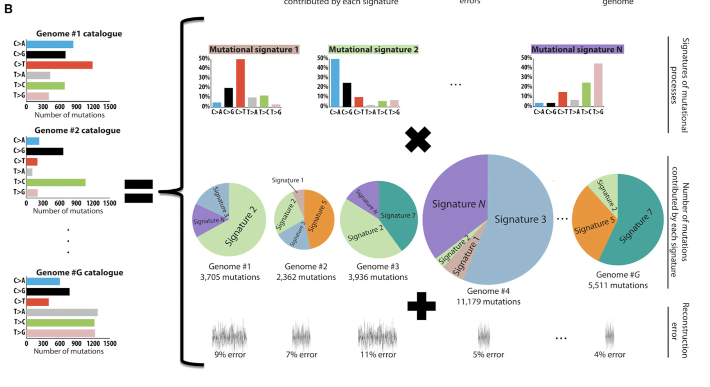{width=70%}

## Method for deciphering signatures of mutational processes

1. Input matrix $M$ of dimension $K$ (mutation types) by $G$ (genomes).

2. Remove rare mutations ($\leq 1\%$).

3. Monte Carlo bootstrap resampling.


## Method for deciphering signatures of mutational processes.

4. Apply the multiplicative update algorithm until convergence.
* Repeat steps 3 and 4 $I$ times, each time storing $P$ and $E$.
* Typical values $I=400-500$


{width=35%}

{width=30%}


## Method for deciphering signatures of mutational processes

5. Cluster the signatures (columns of $P$ matrix) from the $I$ iterations into $N$ clusters, one signature per cluster for each of the $I$ matrices.
  * This automatically clusters the exposures.
  * Use cosine similarity for clustering.

{width=40%}{width=25%}
{width=40%}


## Method for deciphering signatures of mutational processes

6. Create the iteration averaged centroid matrix, $\overline{\rm P}$, by averaging the signatures within each cluster.

7. Evaluate the reproducibility of the signatures by calculating the average silhouette width over the $N$ clusters.

{width=50%}


## Method for deciphering signatures of mutational processes

8. Evaluate the accuracy of the approximation of $M$ by calculating the Frobenius reconstruction errors.

{width=40%}

9. Repeat steps 1-8 for different values of $N=1,\dots,min(K,G)-1$.

## Method for deciphering signatures of mutational processes

10. Choose an $N$ corresponding to highly reproducible mutational signatures and low reconstruction error.

{height=40%}


## The method recovers 10 signatures in a simulated cancer genome dataset


## The method recovers 10 signatures in a simulated cancer genome dataset

* 100 simulated cancer genome mutational catalogs
* 10 mutational processes with distinct signatures over 96 mutation types
* Add Poisson noise

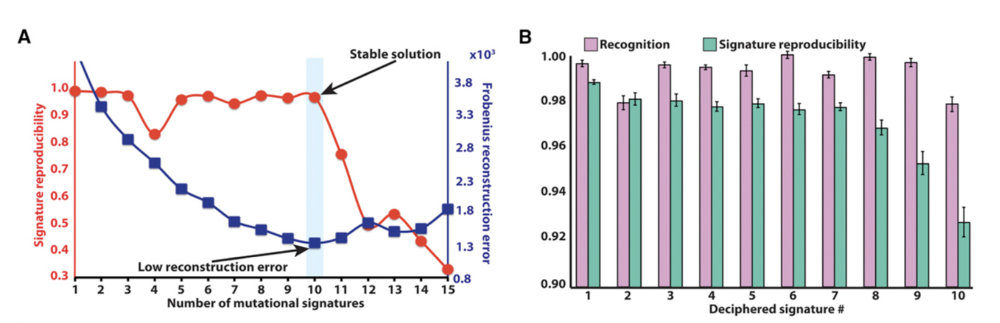

## The method recovers 10 signatures in a simulated cancer genome dataset

Deciphered and simulated contributions of the mutational signatures are similar.


## The method recovers 10 signatures in a simulated cancer genome dataset

Deciphered and simulated mutation signatures and catalogs are similar.

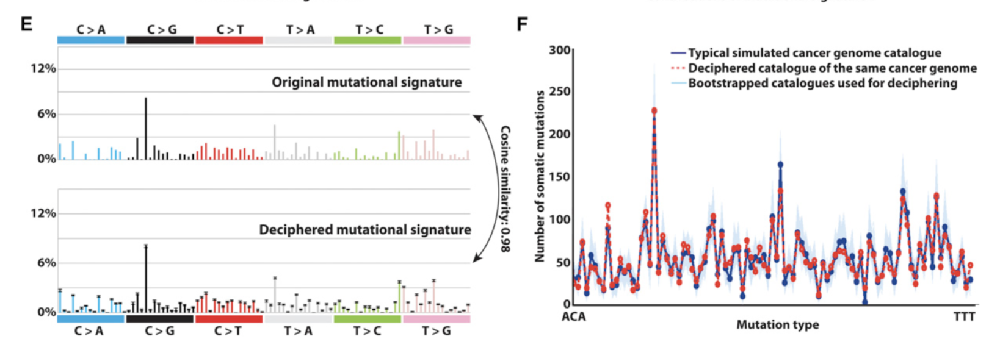


## The method is affected by the number of genomes, uniqueness of signatures, and number of mutations

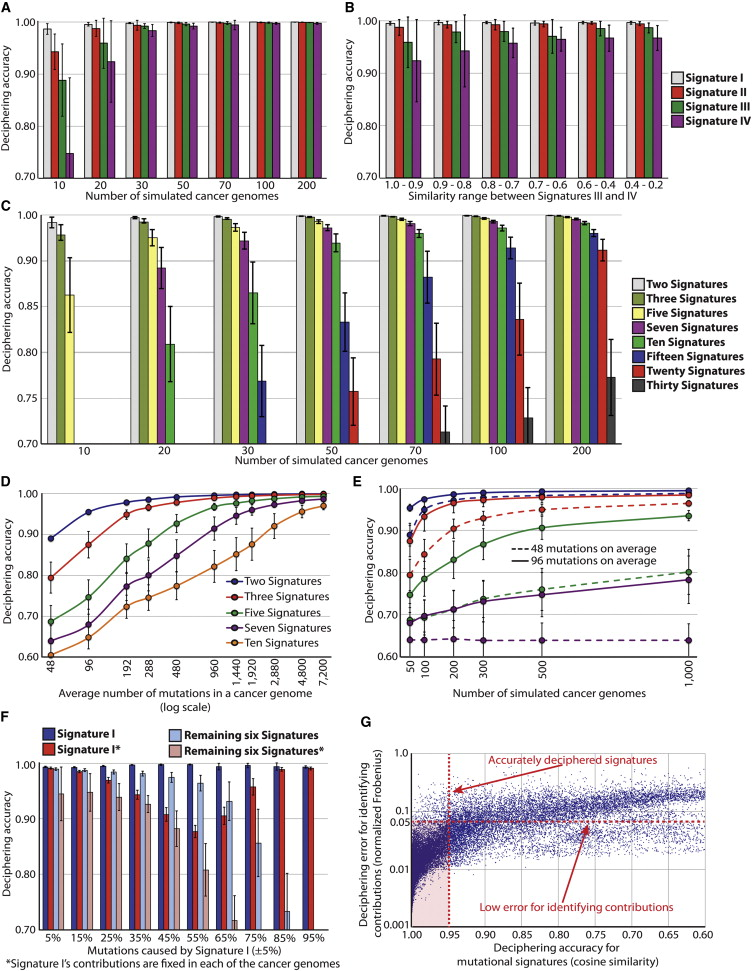

## The method is affected by the number of genomes, uniqueness of signatures, and number of mutations

The similarity of mutational signatures affects the method performance.

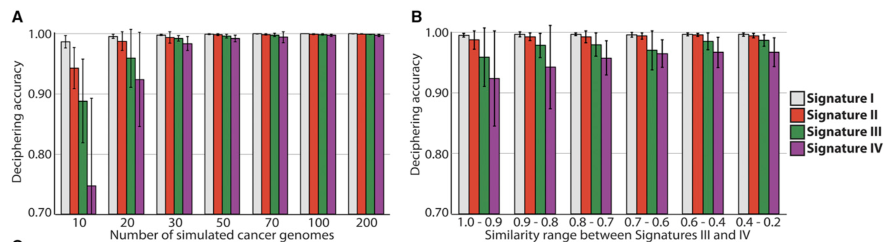

## The method is affected by the number of genomes, uniqueness of signatures, and number of mutations

More mutational signatures require more genomes.

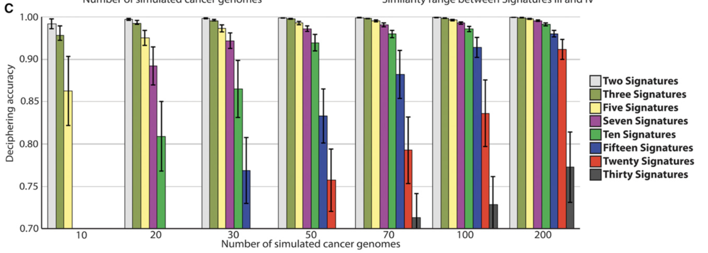


## The method is affected by the number of genomes, uniqueness of signatures, and number of mutations

The method performs better when there are more mutations in the cancer genomes.

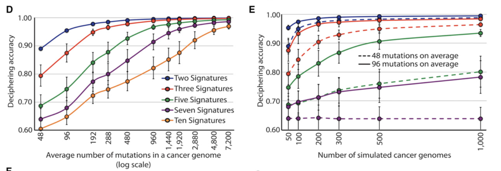

## The method is affected by the number of genomes, uniqueness of signatures, and number of mutations

Accurately deciphered mutational signatures correspond to accurate exposure estimates.

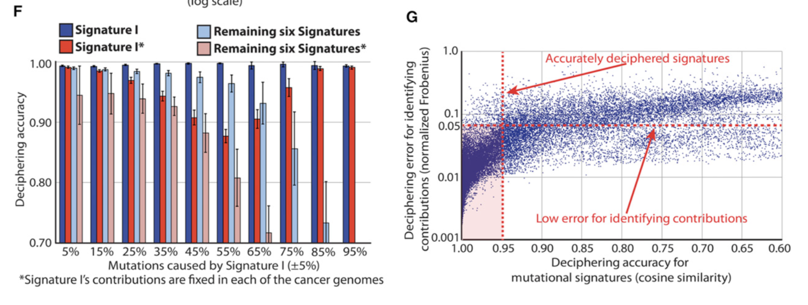


## Findings: @nikzainal2012breastcancer

__Data__

* 21 primary breast cancer samples

* Whole-genome sequencing, ~30X coverage

* Mutation alphabet:

    * 96 base substitutions (6 types $\times$ 16 5'- $\times$ 16 3'-dinucleotides)
    * Kataegis
    * Double nucleotide substitutions
    * Indels at microhomologies
    * Indels at mono/polynucleotide repeats

* Previously described 5 mutational signatures

## Findings: @nikzainal2012breastcancer

\begin{columns}

\begin{column}{0.53\textwidth}
\begin{itemize}
\item{96 base mutations}
\item{Extracted 4 reproducible signatures, similar to 4 previously identified signatures (A, B, D, E)}
\item{Signature C similar to Signature D $\rightarrow$ incorporated into Signature 3}
\end{itemize}
\end{column}

\begin{column}{0.43\textwidth}
\begin{figure}
\includegraphics{./figs/figure4a.png}
\end{figure}
\end{column}

\end{columns}

## Findings: @nikzainal2012breastcancer

\begin{columns}

\begin{column}{0.48\textwidth}
\begin{itemize}
\item{96 base mutations + 4 subclasses}
\item{Signatures 1-4 largely unmodified}
\item{Now able to detect Signature 5}
\item{"kataegis is mostly independent from other four mutational signatures"}
\end{itemize}
\end{column}

\begin{column}{0.48\textwidth}
\begin{figure}
\includegraphics{./figs/figure4b.png}
\end{figure}
\end{column}

\end{columns}

## Findings: @nikzainal2012breastcancer

\begin{columns}

\begin{column}{0.48\textwidth}
\begin{itemize}
\item{96 base mutations $\times$  +/- transcribed strand}
\item{Recovered previous 4 signatures}
\item{Observed C>A strand bias in Signatures 1 and 3}
\end{itemize}
\end{column}

\begin{column}{0.48\textwidth}
\begin{figure}
\includegraphics{./figs/figure5b.png}
\end{figure}
\end{column}

\end{columns}

## Findings: @nikzainal2012breastcancer

\begin{columns}

\begin{column}{0.48\textwidth}
\begin{itemize}
\item{96 base mutations $\times$ 256 neighboring 5'- and 3'- dinucleotides}
\item{Identified 3 reproducible signatures}
\item{Signature 2: strong bias for pyrimidine-T-C-N-N}
\end{itemize}
\end{column}

\begin{column}{0.48\textwidth}
\begin{figure}
\includegraphics{./figs/figure6c.png}
\end{figure}
\end{column}

\end{columns}

## Findings: @nikzainal2012breastcancer

__Takeaways__

* Can recover previously identified signatures

    * Reassuring, but slightly misleading

    * Previous paper (same authors) also used NMF, but with different model
      selection procedure

* Incorporate different mutation types (i.e. kataegis)

* Can recover transcriptional strand bias

* Can observe sequence context dependencies

## Findings: @stephens2012breastcancer

__Data__

* 100 primary breast cancer samples

* Exome-sequencing (21,416 protein-coding genes; 1,664 microRNAs)

* Mutation alphabet:

    * Base substitutions
    * Indels

## Findings: @stephens2012breastcancer

\begin{columns}

\begin{column}{0.48\textwidth}
\begin{itemize}
\item{25-fold fewer mutations than whole-genome sequencing}
\item{Identified 2 exome signatures, similar to Signatures 1 and 2}
\end{itemize}
\end{column}

\begin{column}{0.48\textwidth}
\begin{figure}
\includegraphics{./figs/figure7a.png}
\end{figure}
\end{column}

\end{columns}

## Findings: @stephens2012breastcancer

\begin{columns}

\begin{column}{0.48\textwidth}
\begin{itemize}
\item{Exome signature 2 shows context-specific strand bias}
\item{Can also find in whole genome data $\rightarrow$ but only if restrict to exons}
\item{Suggests strand bias might be exclusive to exons}
\end{itemize}
\end{column}

\begin{column}{0.48\textwidth}
\begin{figure}
\includegraphics{./figs/figure7b.png}
\end{figure}
\end{column}

\end{columns}

## Findings: @stephens2012breastcancer

__Takeaways__

* More exome-sequencing data than whole genome

* Fewer mutation numbers means fewer detectable signatures

* Dividing genome into distinct functional regions can reveal interesting biology

# Discussion

## Summary

"This study demonstrates that an approach based on the simplest (i.e. without additional constraints) NMF algorithm is sufficient to decipher signatures of mutational processes from catalogs of mutation from cancer genomes."

## Future Directions

__Biological__

* Experimental procedures to isolate signature from specific exposure

* Bioinformatics approaches to annotate signatures

__Computational__

* Incorporate additional constraints to exposure matrix $E$

    * Strong sparsity constraint to describe mixture by minimum signals

* Metrics to evaluate to select number of signatures $N$ to be deciphered

## Discussion

* Question 1:

* Question 2:

## Discussion

* What do you all think?

## References

